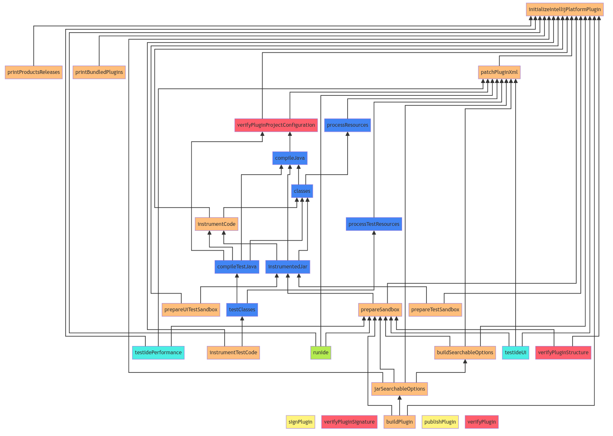

# Gradle Task Dependencies with Mermaid

This Python script uses the Gradle plugin `com.dorongold.task-tree` to calculate
the task dependencies of all tasks in a
[IntelliJ Platform Gradle Plugin](https://github.com/JetBrains/intellij-platform-gradle-plugin).
From this dependency tree, it calculates all edges between nodes and creates a 
[Mermaid FlowChart](https://mermaid.js.org/) string representation that can be rendered as an image like this:



# Usage

First, you need to have an IntelliJ Platform Plugin project that uses the IntelliJ Platform Gradle Plugin build setup.
You should have all tasks configured properly because otherwise, the dependency calculation will fail for
certain tasks.

Add the dependency to `taskTree` to your `plugins` section in `build.gradle.kts`

```
plugins {
    id("com.dorongold.task-tree") version "3.0.0"
}
```

Clone this repository and then call the following **from within** IntelliJ Plugin directory

```shell
python3 /path/to/mermaid_representation.py
```

At the moment, the Mermaid code will simply be printed to the console.
You can copy it and paste it the [Mermaid Live Editor](https://mermaid.live).

# Notes

The final graph layout depends on the order of the links between nodes. For now, I use
`MermaidRepresentation._sort_connections` to sort links `A --> B` by how often `B` appears on the left side
of a connection. This _seems_ to give a somewhat better layout.

Not all settings available are currently used properly. For example, the `mermaid_representation.TaskGroup` class
is supposed to collect similar tasks into `subgraph` boxes.
However, the definition of which tasks belong together needs to be discussed.
Additionally, the `mermaid_representation.MermaidStyle` gives another way of representing nodes that belong together
in the same style.
Again, it needs to be discussed which nodes belong to the same style group.

Finally, during the analysis, we will find connections of IntelliJ Platform Gradle Plugin
Tasks to core Gradle tasks, and it's not clear if we should show them or not.
