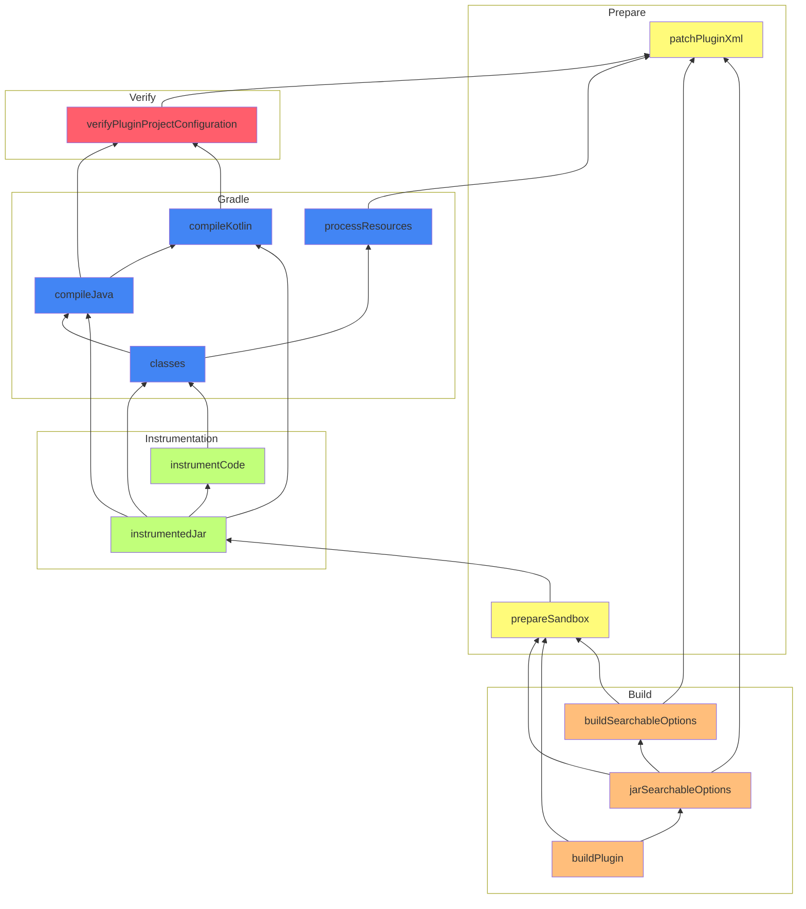

# buildPlugin

```mermaid
%%{init: {"flowchart": {"curve": "basis"}} }%%
flowchart BT


    subgraph BuildGroup["Build"]
         direction LR
         style BuildGroup fill:transparent
        buildPlugin:::buildStyle
        buildSearchableOptions:::buildStyle
        jarSearchableOptions:::buildStyle
        jarSearchableOptions --> buildSearchableOptions
        buildPlugin --> jarSearchableOptions
    end

    subgraph VerifyGroup["Verify"]
         direction LR
         style VerifyGroup fill:transparent
        verifyPluginProjectConfiguration:::verifyStyle
    end

    subgraph GradleGroup["Gradle"]
         direction LR
         style GradleGroup fill:transparent
        classes:::gradleStyle
        compileJava:::gradleStyle
        processResources:::gradleStyle
        compileKotlin:::gradleStyle
        compileJava --> compileKotlin
        classes --> processResources
        classes --> compileJava
    end

    subgraph InstrumentationGroup["Instrumentation"]
         direction LR
         style InstrumentationGroup fill:transparent
        instrumentedJar:::instrumentStyle
        instrumentCode:::instrumentStyle
        instrumentedJar --> instrumentCode
    end

    subgraph PrepareGroup["Prepare"]
         direction LR
         style PrepareGroup fill:transparent
        prepareSandbox:::prepareStyle
        patchPluginXml:::prepareStyle
    end


        compileJava --> verifyPluginProjectConfiguration
        jarSearchableOptions --> prepareSandbox
        verifyPluginProjectConfiguration --> patchPluginXml
        processResources --> patchPluginXml
        instrumentedJar --> classes
        instrumentCode --> classes
        buildSearchableOptions --> patchPluginXml
        jarSearchableOptions --> patchPluginXml
        instrumentedJar --> compileKotlin
        buildPlugin --> prepareSandbox
        prepareSandbox --> instrumentedJar
        instrumentedJar --> compileJava
        buildSearchableOptions --> prepareSandbox
        compileKotlin --> verifyPluginProjectConfiguration

    classDef gradleStyle fill:#4285f4
    classDef runStyle fill:#b4ec51
    classDef instrumentStyle fill:#C1FF7A
    classDef buildStyle fill:#ffbe7b
    classDef publishStyle fill:#fff47d
    classDef prepareStyle fill:#FFFB7A
    classDef printStyle fill:#7AFFCE
    classDef testStyle fill:#4beee3
    classDef verifyStyle fill:#ff5e6c

    click prepareSandbox "#prepareSandbox"
    click verifyPluginProjectConfiguration "#verifyPluginProjectConfiguration"
    click buildPlugin "#buildPlugin"
    click instrumentedJar "#instrumentedJar"
    click buildSearchableOptions "#buildSearchableOptions"
    click jarSearchableOptions "#jarSearchableOptions"
    click instrumentCode "#instrumentCode"
    click patchPluginXml "#patchPluginXml"
```
