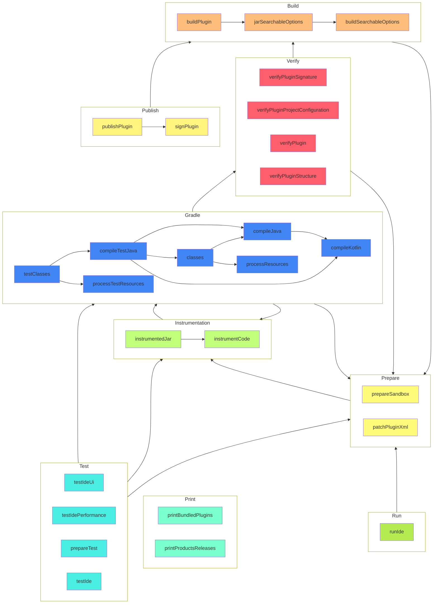

# Overview All Tasks Grouped

```mermaid
%%{init: {"flowchart": {"curve": "basis"}} }%%
flowchart BT


    subgraph BuildGroup["Build"]
         direction LR
         style BuildGroup fill:transparent
        buildPlugin:::buildStyle
        buildSearchableOptions:::buildStyle
        jarSearchableOptions:::buildStyle
        jarSearchableOptions --> buildSearchableOptions
        buildPlugin --> jarSearchableOptions
    end

    subgraph VerifyGroup["Verify"]
         direction LR
         style VerifyGroup fill:transparent
        verifyPluginSignature:::verifyStyle
        verifyPluginProjectConfiguration:::verifyStyle
        verifyPlugin:::verifyStyle
        verifyPluginStructure:::verifyStyle
    end

    subgraph GradleGroup["Gradle"]
         direction LR
         style GradleGroup fill:transparent
        classes:::gradleStyle
        compileJava:::gradleStyle
        testClasses:::gradleStyle
        processResources:::gradleStyle
        compileKotlin:::gradleStyle
        compileTestJava:::gradleStyle
        processTestResources:::gradleStyle
        compileJava --> compileKotlin
        compileTestJava --> classes
        classes --> processResources
        compileTestJava --> compileJava
        compileTestJava --> compileKotlin
        testClasses --> compileTestJava
        testClasses --> processTestResources
        classes --> compileJava
    end

    subgraph TestGroup["Test"]
         direction LR
         style TestGroup fill:transparent
        testIdeUi:::testStyle
        testIdePerformance:::testStyle
        prepareTest:::testStyle
        testIde:::testStyle
    end

    subgraph InstrumentationGroup["Instrumentation"]
         direction LR
         style InstrumentationGroup fill:transparent
        instrumentedJar:::instrumentStyle
        instrumentCode:::instrumentStyle
        instrumentedJar --> instrumentCode
    end

    subgraph PrintGroup["Print"]
         direction LR
         style PrintGroup fill:transparent
        printBundledPlugins:::printStyle
        printProductsReleases:::printStyle
    end

    subgraph RunGroup["Run"]
         direction LR
         style RunGroup fill:transparent
        runIde:::runStyle
    end

    subgraph PublishGroup["Publish"]
         direction LR
         style PublishGroup fill:transparent
        signPlugin:::publishStyle
        publishPlugin:::publishStyle
        publishPlugin --> signPlugin
    end

    subgraph PrepareGroup["Prepare"]
         direction LR
         style PrepareGroup fill:transparent
        prepareSandbox:::prepareStyle
        patchPluginXml:::prepareStyle
    end


    TestGroup --> GradleGroup
    VerifyGroup --> PrepareGroup
    RunGroup --> PrepareGroup
    BuildGroup --> PrepareGroup
    GradleGroup --> PrepareGroup
    PrepareGroup --> InstrumentationGroup
    TestGroup --> InstrumentationGroup
    PublishGroup --> BuildGroup
    VerifyGroup --> BuildGroup
    GradleGroup --> VerifyGroup
    TestGroup --> PrepareGroup
    GradleGroup --> InstrumentationGroup
    InstrumentationGroup --> GradleGroup

    classDef gradleStyle fill:#4285f4
    classDef runStyle fill:#b4ec51
    classDef instrumentStyle fill:#C1FF7A
    classDef buildStyle fill:#ffbe7b
    classDef publishStyle fill:#fff47d
    classDef prepareStyle fill:#FFFB7A
    classDef printStyle fill:#7AFFCE
    classDef testStyle fill:#4beee3
    classDef verifyStyle fill:#ff5e6c

    click runIde "#runIde"
    click printBundledPlugins "#printBundledPlugins"
    click prepareSandbox "#prepareSandbox"
    click printProductsReleases "#printProductsReleases"
    click verifyPluginSignature "#verifyPluginSignature"
    click verifyPluginProjectConfiguration "#verifyPluginProjectConfiguration"
    click verifyPlugin "#verifyPlugin"
    click testIdeUi "#testIdeUi"
    click buildPlugin "#buildPlugin"
    click testIdePerformance "#testIdePerformance"
    click instrumentedJar "#instrumentedJar"
    click signPlugin "#signPlugin"
    click buildSearchableOptions "#buildSearchableOptions"
    click prepareTest "#prepareTest"
    click jarSearchableOptions "#jarSearchableOptions"
    click publishPlugin "#publishPlugin"
    click patchPluginXml "#patchPluginXml"
    click instrumentCode "#instrumentCode"
    click verifyPluginStructure "#verifyPluginStructure"
    click testIde "#testIde"
```
