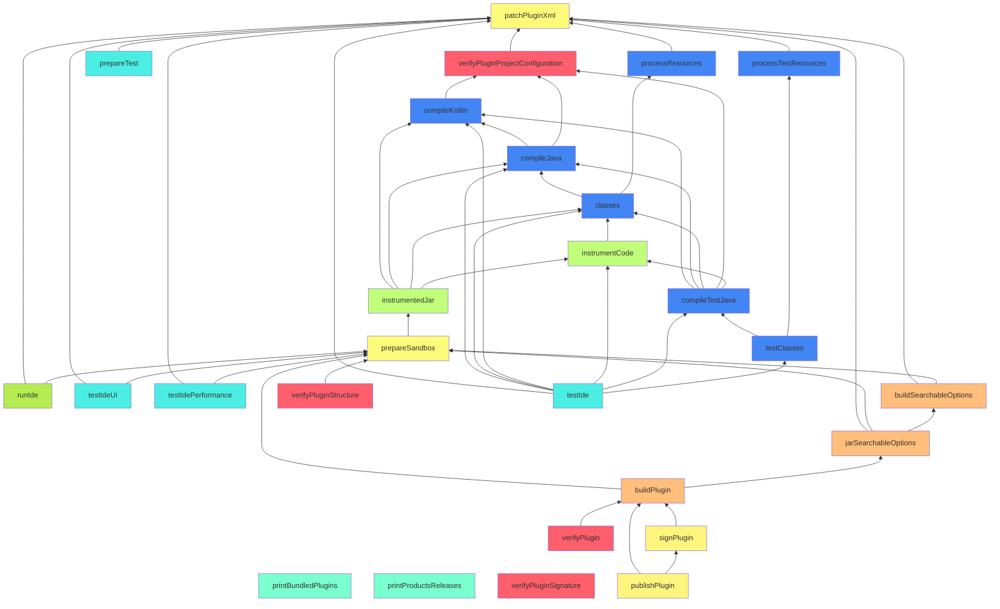

# Overview All Tasks

```mermaid
%%{init: {"flowchart": {"curve": "basis"}} }%%
flowchart BT


    runIde:::runStyle
    classes:::gradleStyle
    compileJava:::gradleStyle
    printBundledPlugins:::printStyle
    prepareSandbox:::prepareStyle
    testClasses:::gradleStyle
    printProductsReleases:::printStyle
    verifyPluginSignature:::verifyStyle
    verifyPluginProjectConfiguration:::verifyStyle
    verifyPlugin:::verifyStyle
    testIdeUi:::testStyle
    buildPlugin:::buildStyle
    testIdePerformance:::testStyle
    processResources:::gradleStyle
    instrumentedJar:::instrumentStyle
    signPlugin:::publishStyle
    buildSearchableOptions:::buildStyle
    prepareTest:::testStyle
    compileKotlin:::gradleStyle
    jarSearchableOptions:::buildStyle
    publishPlugin:::publishStyle
    compileTestJava:::gradleStyle
    patchPluginXml:::prepareStyle
    instrumentCode:::instrumentStyle
    verifyPluginStructure:::verifyStyle
    testIde:::testStyle
    processTestResources:::gradleStyle

    jarSearchableOptions --> buildSearchableOptions
    classes --> processResources
    testIde --> testClasses
    prepareSandbox --> instrumentedJar
    testClasses --> processTestResources
    buildPlugin --> jarSearchableOptions
    publishPlugin --> signPlugin
    testIde --> compileTestJava
    testClasses --> compileTestJava
    instrumentedJar --> instrumentCode
    compileTestJava --> instrumentCode
    signPlugin --> buildPlugin
    testIde --> instrumentCode
    compileTestJava --> verifyPluginProjectConfiguration
    compileJava --> verifyPluginProjectConfiguration
    publishPlugin --> buildPlugin
    verifyPlugin --> buildPlugin
    compileKotlin --> verifyPluginProjectConfiguration
    compileJava --> compileKotlin
    testIde --> compileKotlin
    instrumentedJar --> classes
    compileTestJava --> classes
    instrumentedJar --> compileJava
    instrumentCode --> classes
    compileTestJava --> compileJava
    instrumentedJar --> compileKotlin
    compileTestJava --> compileKotlin
    testIde --> classes
    testIde --> compileJava
    classes --> compileJava
    runIde --> prepareSandbox
    jarSearchableOptions --> prepareSandbox
    verifyPluginStructure --> prepareSandbox
    buildSearchableOptions --> prepareSandbox
    testIdeUi --> prepareSandbox
    testIdePerformance --> prepareSandbox
    buildPlugin --> prepareSandbox
    verifyPluginProjectConfiguration --> patchPluginXml
    processResources --> patchPluginXml
    runIde --> patchPluginXml
    jarSearchableOptions --> patchPluginXml
    testIde --> patchPluginXml
    processTestResources --> patchPluginXml
    buildSearchableOptions --> patchPluginXml
    testIdeUi --> patchPluginXml
    testIdePerformance --> patchPluginXml
    prepareTest --> patchPluginXml


    classDef gradleStyle fill:#4285f4
    classDef runStyle fill:#b4ec51
    classDef instrumentStyle fill:#C1FF7A
    classDef buildStyle fill:#ffbe7b
    classDef publishStyle fill:#fff47d
    classDef prepareStyle fill:#FFFB7A
    classDef printStyle fill:#7AFFCE
    classDef testStyle fill:#4beee3
    classDef verifyStyle fill:#ff5e6c

    click buildPlugin "#buildPlugin"
    click testIdePerformance "#testIdePerformance"
    click jarSearchableOptions "#jarSearchableOptions"
    click prepareTest "#prepareTest"
    click runIde "#runIde"
    click buildSearchableOptions "#buildSearchableOptions"
    click verifyPluginSignature "#verifyPluginSignature"
    click patchPluginXml "#patchPluginXml"
    click instrumentedJar "#instrumentedJar"
    click verifyPlugin "#verifyPlugin"
    click prepareSandbox "#prepareSandbox"
    click signPlugin "#signPlugin"
    click verifyPluginProjectConfiguration "#verifyPluginProjectConfiguration"
    click verifyPluginStructure "#verifyPluginStructure"
    click testIde "#testIde"
    click testIdeUi "#testIdeUi"
    click instrumentCode "#instrumentCode"
    click printProductsReleases "#printProductsReleases"
    click publishPlugin "#publishPlugin"
    click printBundledPlugins "#printBundledPlugins"
```
