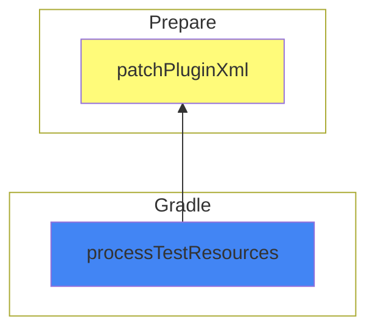

# processTestResources

```mermaid
%%{init: {"flowchart": {"curve": "basis"}} }%%
flowchart BT


    subgraph GradleGroup["Gradle"]
         direction LR
         style GradleGroup fill:transparent
        processTestResources:::gradleStyle
    end

    subgraph PrepareGroup["Prepare"]
         direction LR
         style PrepareGroup fill:transparent
        patchPluginXml:::prepareStyle
    end


        processTestResources --> patchPluginXml

    classDef gradleStyle fill:#4285f4
    classDef runStyle fill:#b4ec51
    classDef instrumentStyle fill:#C1FF7A
    classDef buildStyle fill:#ffbe7b
    classDef publishStyle fill:#fff47d
    classDef prepareStyle fill:#FFFB7A
    classDef printStyle fill:#7AFFCE
    classDef testStyle fill:#4beee3
    classDef verifyStyle fill:#ff5e6c

    click patchPluginXml "#patchPluginXml"
```
