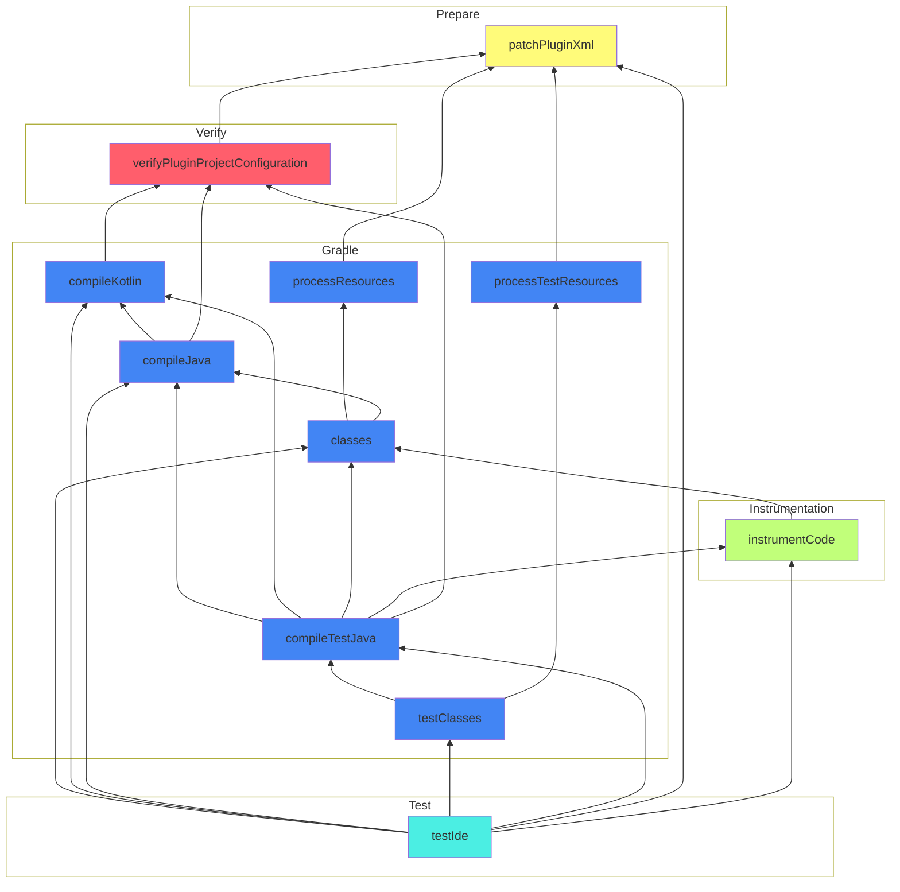

# testIde

```mermaid
%%{init: {"flowchart": {"curve": "basis"}} }%%
flowchart BT


    subgraph VerifyGroup["Verify"]
         direction LR
         style VerifyGroup fill:transparent
        verifyPluginProjectConfiguration:::verifyStyle
    end

    subgraph GradleGroup["Gradle"]
         direction LR
         style GradleGroup fill:transparent
        classes:::gradleStyle
        compileJava:::gradleStyle
        testClasses:::gradleStyle
        processResources:::gradleStyle
        compileKotlin:::gradleStyle
        compileTestJava:::gradleStyle
        processTestResources:::gradleStyle
        compileTestJava --> compileJava
        compileJava --> compileKotlin
        compileTestJava --> compileKotlin
        compileTestJava --> classes
        testClasses --> compileTestJava
        testClasses --> processTestResources
        classes --> processResources
        classes --> compileJava
    end

    subgraph TestGroup["Test"]
         direction LR
         style TestGroup fill:transparent
        testIde:::testStyle
    end

    subgraph InstrumentationGroup["Instrumentation"]
         direction LR
         style InstrumentationGroup fill:transparent
        instrumentCode:::instrumentStyle
    end

    subgraph PrepareGroup["Prepare"]
         direction LR
         style PrepareGroup fill:transparent
        patchPluginXml:::prepareStyle
    end


        testIde --> classes
        compileJava --> verifyPluginProjectConfiguration
        verifyPluginProjectConfiguration --> patchPluginXml
        testIde --> compileKotlin
        compileTestJava --> instrumentCode
        testIde --> compileJava
        instrumentCode --> classes
        processTestResources --> patchPluginXml
        testIde --> testClasses
        testIde --> compileTestJava
        compileTestJava --> verifyPluginProjectConfiguration
        compileKotlin --> verifyPluginProjectConfiguration
        testIde --> patchPluginXml
        processResources --> patchPluginXml
        testIde --> instrumentCode

    classDef gradleStyle fill:#4285f4
    classDef runStyle fill:#b4ec51
    classDef instrumentStyle fill:#C1FF7A
    classDef buildStyle fill:#ffbe7b
    classDef publishStyle fill:#fff47d
    classDef prepareStyle fill:#FFFB7A
    classDef printStyle fill:#7AFFCE
    classDef testStyle fill:#4beee3
    classDef verifyStyle fill:#ff5e6c

    click verifyPluginProjectConfiguration "#verifyPluginProjectConfiguration"
    click patchPluginXml "#patchPluginXml"
    click instrumentCode "#instrumentCode"
    click testIde "#testIde"
```
